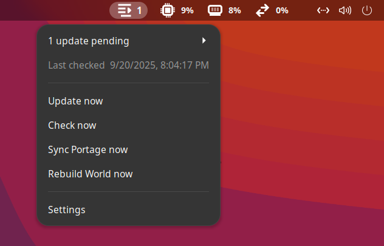
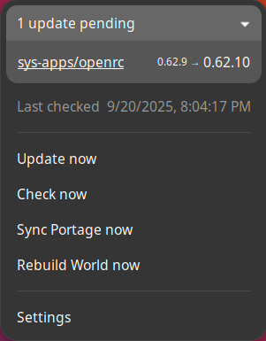
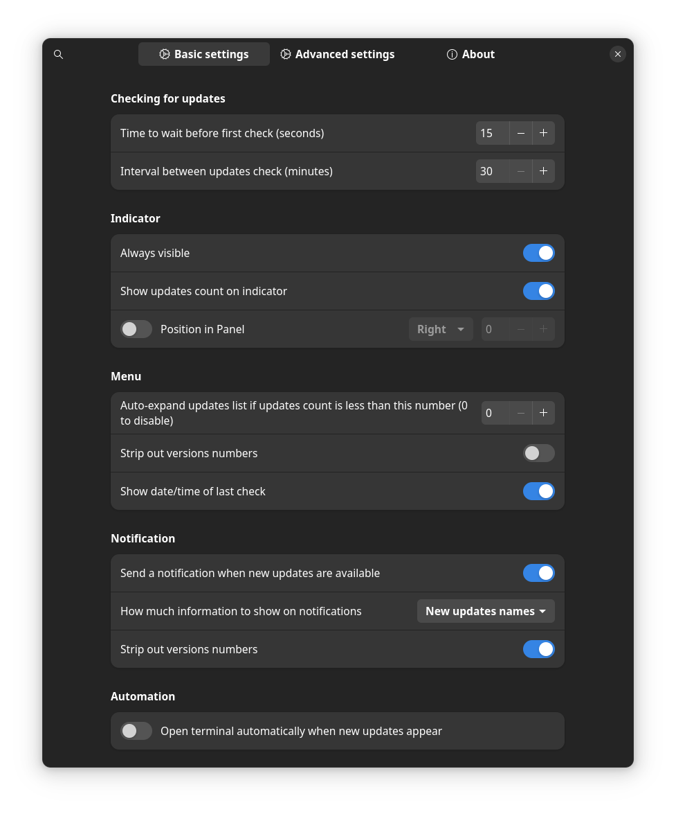
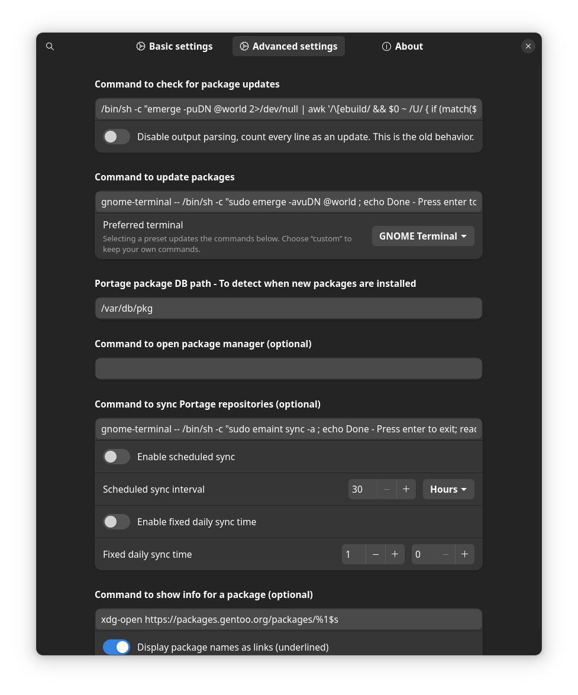
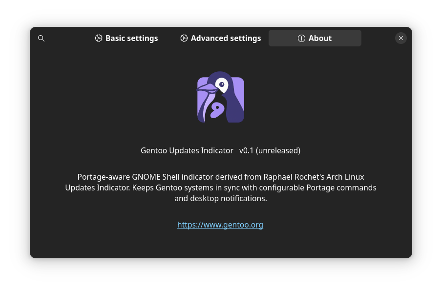
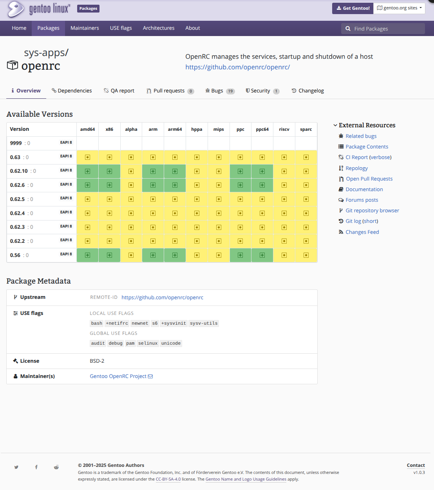

# Gentoo Updates Indicator

  

> Portage-aware GNOME Shell extension that keeps Gentoo workstations in sync with smart scheduling, upgrade insights, and one-click maintenance commands.

<table>
  <tr>
    <td align="center" valign="middle" width="156">
      
    </td>
    <td valign="middle">
      <p align="justify">
        <strong>Gentoo Updates Indicator</strong> is a polished port of Raphael Rochet celebrated
        <em>Arch Linux Updates Indicator</em>, tailored for Portage workflows. The extension adds a discrete
        status icon to the GNOME top bar, keeps track of <code>emerge -puDN @world</code>, and turns common
        maintenance tasks—sync, update, rebuild—into one-click actions that launch in the terminal you already use.
      </p>
    </td>
  </tr>
</table>


---

## Highlights
- **Instant upgrade visibility** – parses Portage output client-side (no root required) and lists `category/package old → new` directly inside the panel menu.
- **Actionable menu** – launch your preferred terminal with the update command, trigger `emaint sync`, or start a full `Rebuild World` from the same dropdown.
- **Gentoo-native automation** – schedule periodic checks, recurring syncs, or a fixed daily sync; monitor `/var/db/pkg` to auto-refresh after emerge operations.
- **Context-rich notifications** – optional alerts with package lists, version diffs, and an “Update now” action; can auto-open your terminal when new updates land.
- **Clickable package intelligence** – jump straight to `packages.gentoo.org` (or your own info command) for detailed changelogs, USE flags, and bug links.
- **Terminal presets & theming** – GNOME Terminal, Tilix, Terminator, Kitty, Alacritty, Foot or custom commands; honours Adwaita symbolic icons when available.

## Indicator at a Glance
| State | Icon name | Meaning |
| --- | --- | --- |
| Unknown | `system-run-symbolic` | First run or status not yet available. |
| Checking | `view-restore-symbolic` | A check command is running. |
| Updates available | `format-indent-less-rtl-symbolic` + badge | New upgrades detected; badge shows count when enabled. |
| Up to date | `selection-mode-symbolic` | Portage reported no pending upgrades. |
| Error | `action-unavailable-symbolic` | The check command failed; hover menu lists the error string. |

Each package entry in the menu shows `old → new` versions. When link mode is enabled, entries become buttons that open the package page in your browser.

## Requirements
- Gentoo Linux with Portage and GNOME Shell **47**, **48** or **49**.
- A terminal emulator (defaults to `gnome-terminal` but any configured preset works).
- Optional: notification daemon (GNOME Shell provides one by default).

## Installation
### Local user install
1. Clone or download this repository.
2. Copy or symlink the folder to `~/.local/share/gnome-shell/extensions/gentoo-updates-indicator@local`.
3. Recompile schemas: `glib-compile-schemas ~/.local/share/gnome-shell/extensions/gentoo-updates-indicator@local/schemas`.
4. Reload GNOME Shell (`Alt`+`F2`, type `r`) on Xorg or log out/in on Wayland.
5. Enable the extension via *Extensions* or `gnome-extensions enable gentoo-updates-indicator@local`.

### System-wide install (root)
```bash
sudo mkdir -p /usr/share/gnome-shell/extensions
sudo cp -r gentoo-updates-indicator@local /usr/share/gnome-shell/extensions/
sudo glib-compile-schemas /usr/share/gnome-shell/extensions/gentoo-updates-indicator@local/schemas
```
Then enable the extension for desired users with `gnome-extensions enable gentoo-updates-indicator@local`.

### Verify the installation
- Hover the new indicator in the top bar; the menu should show “Waiting first check”.
- Use **Check now** to run the first `emerge -puDN @world` probe (non-root). Errors are logged to `journalctl --user -f`.

## Everyday Workflow
- **Run updates** – select *Update now* to spawn your preset terminal with `sudo emerge -avuDN @world` (or your custom command).
- **Sync Portage** – run *Sync Portage now* which defaults to `sudo emaint sync -a`.
- **Rebuild world** – trigger long-running rebuilds (`emerge -e -av @world`) after profile or USE flag changes.
- **Package drill-down** – click any listed package to jump to its info page; customise the command with the `package-info-cmd` setting.
- **Auto-open terminal** – when enabled, the update terminal launches automatically the first time new upgrades are detected.

### Automation & Scheduling
- **Check cadence** – configure boot delay and recurring interval (5 min – 33 h) from Preferences → General.
- **Directory monitor** – the extension watches `/var/db/pkg` with Gio; changes trigger a quick follow-up check so post-emerge updates are reflected instantly.
- **Sync scheduler** – run `emaint sync` every _n_ hours/days or at a fixed HH:MM. Fixed-time sync overrides the interval schedule.

### Notifications
- Pop a notification when new packages land; optionally include the package list or only the count.
- Strip version numbers in notifications or in-menu for a cleaner look.
- Use the inline **Update now** action directly from the notification bubble.

### Linkification & accessibility
- Toggle `linkify-menu` to underline clickable entries.
- Show/hide badge counts and last-check timestamps for a cleaner panel.

## Preferences Cheat Sheet
- **General**: visibility, badge count, notifications, auto-open terminal, last check timestamp.
- **Commands**: check, update, sync, rebuild, package manager launcher, package info command.
- **Automation**: boot wait, interval, auto-expand list, directory to monitor, sync scheduler (interval or fixed time).
- **Terminals**: presets for GNOME Terminal, Tilix, Terminator, Kitty, Alacritty, Foot, or custom commands.
- **Appearance**: optional indicator repositioning, link styling, version stripping.

All options are backed by the GSettings schema `org.gnome.shell.extensions.gentoo-updates-indicator` (see `schemas/org.gnome.shell.extensions.gentoo-updates-indicator.gschema.xml`).

## Tech Stack & Project Stats
| Language / format | Approx. lines |
| --- | --- |
| JavaScript (extension logic & preferences) | 926 |
| XML (prefs UI & schema) | 719 |
| CSS (theming) | 54 |
| Shell scripts (tooling) | 56 |
| Translations (`.po`) | 1674 |

Key files:
- `extension.js` – GNOME Shell button, menu, schedulers, notifications, Portage parser.
- `prefs.js` + `prefs.xml` – Libadwaita preferences window with terminal presets and automation controls.
- `schemas/…gschema.xml` – all tunables exposed via GSettings.
- `stylesheet.css` – menu styling, clickable links, and version typography.
- `scripts/update-pot.sh`, `scripts/compile-locales.sh` – localisation tooling (xgettext, itstool, msgfmt).

## Localisation
Translations ship for **de_DE**, **es**, **fr**, and **it_IT**. Rebuild locale files after editing strings:
```bash
scripts/update-pot.sh
scripts/compile-locales.sh
```
Custom `package-info-cmd` strings automatically reuse the configured locale.

## Development
```bash
git clone https://github.com/<your-account>/gentoo-updates-indicator.git
cd gentoo-updates-indicator
# Recompile schemas after changes
glib-compile-schemas schemas
# Build an installable zip
gnome-extensions pack gentoo-updates-indicator@local
```

Tips:
- Use `gnome-extensions disable/enable gentoo-updates-indicator@local` to reload during development.
- Watch GNOME Shell logs with `journalctl --user -f | rg gentoo-update`.
- Update translation templates with the scripts in `scripts/`.
- Additional internal notes live in `MAINTENER_NOTES.md`.

## Roadmap Ideas
- Publish on [extensions.gnome.org](https://extensions.gnome.org/) when GNOME 47 QA is complete.
- Health checks for configured terminal executables.
- Combined workflow action (sync → update → optional rebuild) with confirmation dialog.
- Automated test harness for the AWK-based Portage parser.

## Credits & License
- Original concept & UX: [Raphaël Rochet – Arch Linux Updates Indicator](https://github.com/RaphaelRochet/arch-update).
- Gentoo port & maintenance: Omar Semlali.
- Icons: Gentoo-themed symbolic set following GNOME HIG; falls back to Adwaita when available.
- Licensed under the [GNU GPL v3 or later](LICENCE.txt).

If you package this extension downstream, please keep attribution intact and link back to this repository.

## Screenshots

---

<p align="center">
  
</p>
<p align="center"><em>1. Startup state right after GNOME login — the indicator shows a gear icon while initializing checks.</em></p>

---

<p align="center">
  
</p>
<p align="center"><em>2. Top bar with badge count – updates detected and pending.</em></p>

---

<p align="center">
  
</p>
<p align="center"><em>3. Indicator menu with quick actions for update, sync, and rebuild.</em></p>

---

<p align="center">
  
</p>
<p align="center"><em>4. Package update details showing installed and available versions.</em></p>

---

<p align="center">
  
</p>
<p align="center"><em>5. Preferences window – <strong>Basic settings</strong> tab with general options and notifications.</em></p>

---

<p align="center">
  
</p>
<p align="center"><em>6. Preferences window – <strong>Advanced settings</strong> tab for custom commands and scheduling.</em></p>

---

<p align="center">
  
</p>
<p align="center"><em>7. <strong>About</strong> tab with logo, version, and project information.</em></p>

---

<p align="center">
  
</p>
<p align="center"><em>8. Integration with packages.gentoo.org – example package details page.</em></p>

---

